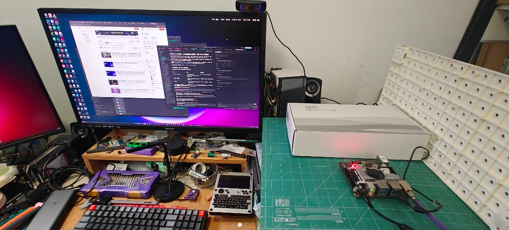
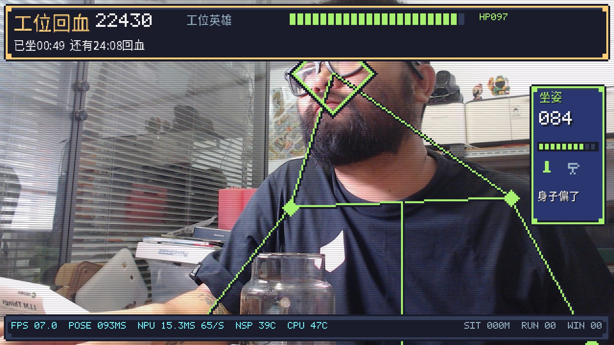
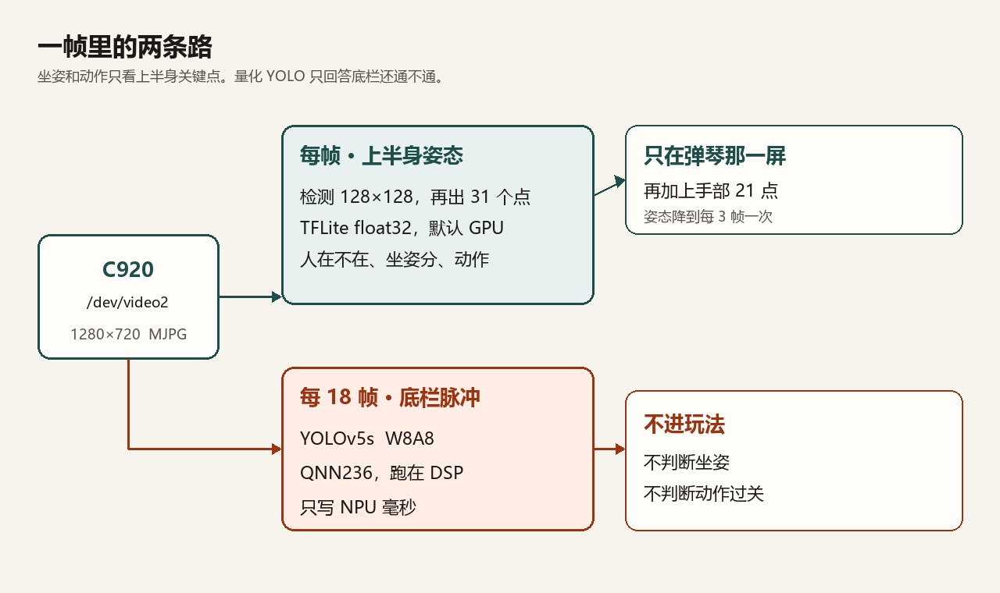
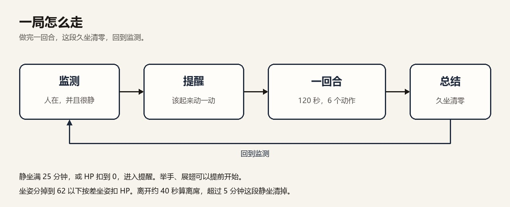
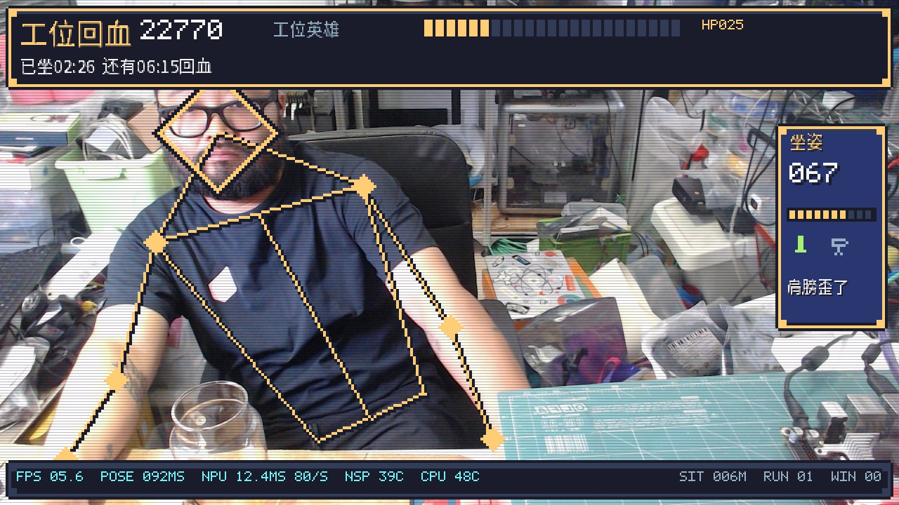
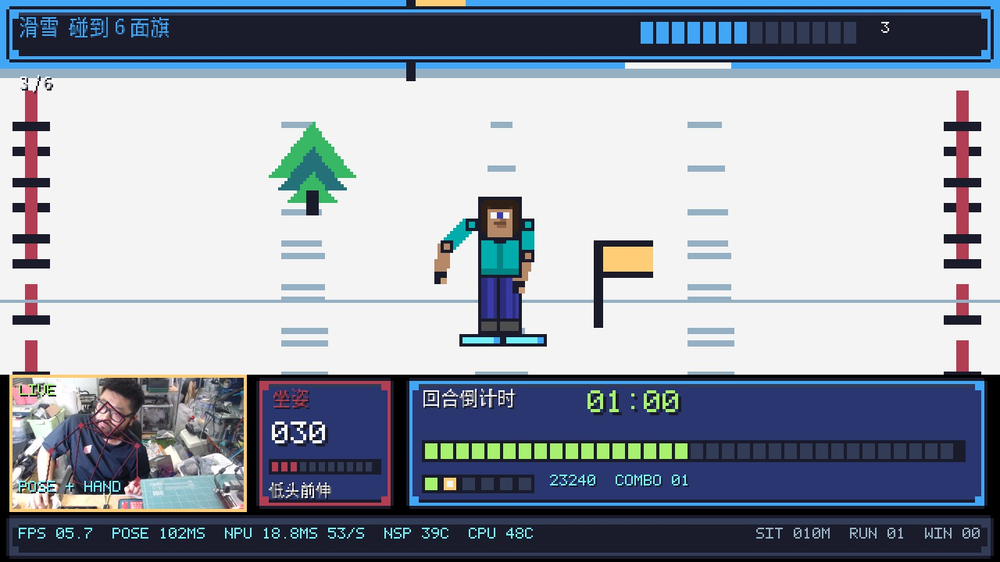
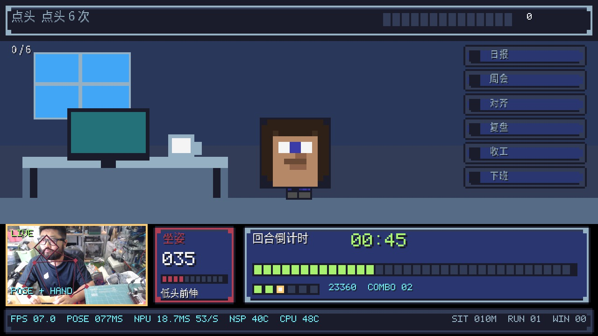
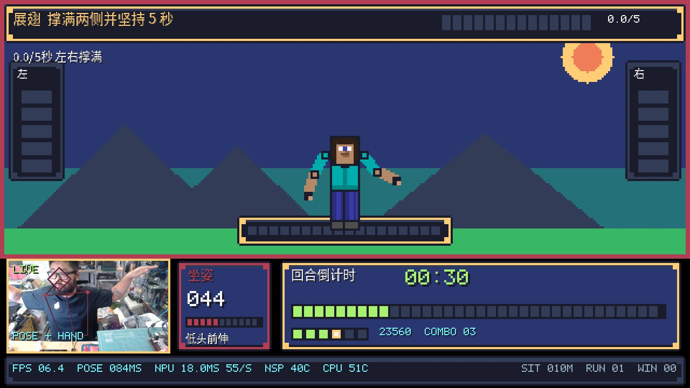

# 没有清闲座椅怎么办？在犀牛派 X1 上做一个工位 AI 教练：姿态识别、久坐监测与体感交互

设备：犀牛派 X1（高通 QCS8550，AidLux / Ubuntu 22.04）｜相机：Logitech C920，`/dev/video2`，1280×720 MJPG｜姿态：AidLite TFLite GPU，float32，上半身 31 点｜底栏：镜像自带 YOLOv5s W8A8，QNN236 DSP｜日期：2026-09-15

摄像头对着工位上半身。人在不在、是不是在静坐、坐姿好不好，都从同一组关键点来。静坐满 25 分钟，或者坐姿把 HP 扣光，进入一组 2 分钟的上半身动作。做完回到监测，这段久坐清零。

浏览器打开 `http://<板子IP>:8090/`。接线、刷机、摄像头为什么不能用 `VideoCapture(0)`、NPU 体检的 4.7 ms，都在上一篇。代码在 [https://github.com/peterpanstechland/rhinopi-x1-aidlux](https://github.com/peterpanstechland/rhinopi-x1-aidlux) 的 `examples/06_shadow_puppet`。

C920 架在屏幕上沿，镜头对着人的上半身。犀牛派 X1 就放在手边的垫子上。





这帧底栏是 **FPS 7.0**、**POSE 93 ms**、**NPU 15.3 ms**，右侧坐姿分 84。

## 1. 两套模型，只有 YOLO 是量化的

没有从模型广场另下权重，用的都是融合镜像里的官方文件。




| 用途         | 模型                                                                    | 精度和后端                           |
| ---------- | --------------------------------------------------------------------- | ------------------------------- |
| 人在不在、坐姿、动作 | `/opt/aidlux/app/aid-examples/pose_detect_track/models/` 里的 BlazePose | TFLite，输入 float32，默认 GPU        |
| 弹琴那一屏的手指   | 同目录旁边 `hand_track/models/` 的手掌检测 + 21 点                               | 同样是 TFLite float32，只在这一屏加载      |
| 底栏脉冲       | `.../cutoff_yolov5s_640_sigmoid_w8a8.qnn236.ctx.bin`                  | W8A8，`TYPE_QNN236` + `TYPE_DSP` |


姿态不走量化包。板上访问不了 pypi.org，镜像里也没有 MediaPipe。官方示例已经带了检测器和 landmark，AidLite 能加载 TFLite。检测框解码、ROI 对齐和关键点平滑在 `pose_tracker.py` 里。

先看叠点可以跑预览，游戏本身不依赖这个页面：

```bash
cd ~/rhinopi-lab/examples/04_mediapipe
python3 pose_preview.py
```

浏览器打开 `http://<板子IP>:8091/`。默认 `/dev/video2`，画面做了镜像。

`PoseTracker` 默认 `accel="GPU"`，工位用 `full_body=False`。


| 阶段     | 模型                                | 输入      | 输出     |
| ------ | --------------------------------- | ------- | ------ |
| 人体检测   | `pose_detection.tflite`           | 128×128 | 896 个框 |
| 上半身关键点 | `pose_landmark_upper_body.tflite` | 256×256 | 31 点   |


配置是 `TYPE_TFLITE`、`TYPE_FAST`、`TYPE_GPU`，输入输出都声明为 `TYPE_FLOAT32`。检测阈值 0.42。检出人之后把 ROI 仿射到 256，再把点映回原图。镜像画面下左肩如果落在画面右侧，会按自拍关系纠正。关键点平滑系数 0.35。

全身模型是 39 点的 `pose_landmark_full_body.tflite`。C920 的工位视野包不住整个人，试过，不作为主线。

`--accel DSP` 能选。报出来的 70–110 ms 是 GPU。没有把这份 float32 BlazePose 当成 DSP 主路径去报帧率。

底栏的 W8A8 YOLO 每 18 帧跑一次，回答「NSP 还通不通」。坐姿判断不看它。坐姿错了改阈值和基线，不要去改这个脉冲。

## 2. 监测什么，一局怎么走




| 阶段        | 画面                                  | 推理            |
| --------- | ----------------------------------- | ------------- |
| 监测、提醒、人离开 | 摄像头加像素叠层，右侧坐姿分                      | 每帧上半身姿态       |
| 挑战和总结     | 上半像素舞台，下半实时小窗、倒计时、坐姿                | 姿态；弹琴再加手部     |
| 底栏        | `FPS`、`POSE ms`、`NPU ms`、NSP/CPU 温度 | YOLOv5s，不参与玩法 |


数字人用关键点驱动四肢角度和头的朝向。坐姿不看动画，直接看点。四项是低头前伸、整个人往下塌、肩膀歪、离屏幕太近，另有一项水平偏移看人是不是坐在画面正中。分数 0–100，掉到 62 以下按差坐姿扣 HP。一回合结束用当时的坐姿重新标定基线。



这帧右侧是「肩膀歪了」，坐姿分 67。底栏 **FPS 5.6**、**POSE 92 ms**、**NPU 12.4 ms**、CPU 48°C。

默认 `--interval-min 25`。人在画面里并且动作很小时累加静坐时间。满 25 分钟，或 HP 被扣到 0，弹出提醒。展翅或举手可以提前开始。

一回合 120 秒，默认抽 6 个动作。每个动作一屏，完成才算过关，然后自动下一屏。时间用完，剩下的记未完成。


| 动作  | 过关条件            | 用到的点                |
| --- | --------------- | ------------------- |
| 展翅  | 双臂撑满并保持 5 秒     | 上半身                 |
| 老鹰  | 扇动 8 次          | 上半身                 |
| 挥手  | 左右挥手送走 10 个人    | 上半身                 |
| 滑雪  | 左右侧身碰到 6 面旗     | 上半身                 |
| 弹琴  | 按中 8 个黄键        | 手部 21 点；姿态降到每 3 帧一次 |
| 跳跃  | 坐着向上颠，跳过 5 个仙人掌 | 上半身                 |
| 转头  | 左右各 3 次         | 上半身                 |
| 点头  | 6 次             | 上半身                 |








这三帧是同一回合里连着的滑雪、点头、展翅。人在左下小窗里。底栏的 POSE 是 GPU 上的姿态耗时：滑雪 **102 ms**、点头 **77 ms**、展翅 **84 ms**。NPU 大约 **18–19 ms**，CPU **48–51°C**。FPS 在 5.7 到 7.0。

弹琴时手部每帧都跑，姿态降频，把帧率留在指尖上。手部是 `palm_detection.tflite`（128）加 `hand_landmark.tflite`（224）。这一屏没有单独记 fps。

人离开画面大约 40 秒算离席，离开超过 5 分钟会把当前这段静坐清掉。进度按天写在 `save.json`。

## 3. 在板上怎么跑

```bash
cd ~/rhinopi-lab/examples/06_shadow_puppet
python3 game.py
python3 game.py --demo
python3 game.py --no-npu
```

`--demo` 把间隔收成 45 秒，用来走完一局，不要拿这个间隔当正式监测。`--accel` 默认 `GPU`。

状态是 `http://<板子IP>:8090/status`。不用坐在镜头前，也可以把每一屏渲染出来核对排版：

```bash
python3 render_probe.py --out /tmp/ui
```


## 4. 帧率记在哪一段

2026-09-15。相机和姿态不是同一个数，量化 YOLO 的两次计时也不是同一个数。


| 读数       | 大约多少                         | 含义                            |
| -------- | ---------------------------- | ----------------------------- |
| 相机 MJPG  | 30.46 fps（平均 32.82 ms）       | C920，1280×720，USB 2.0         |
| 相机 YUYV  | 10 fps                       | 同一分辨率，带宽不够。游戏不用这条             |
| 久坐页      | 约 7–13 fps                   | 采集 + 姿态 + 叠层 + JPEG。上面这帧是 7.0 |
| POSE，检出人 | 70–110 ms                    | TFLite GPU，检测 + landmark      |
| POSE，没检出 | 约 33 ms                      | 只跑检测器                         |
| NPU 底栏   | 9–20 ms                      | 每 18 帧一次，含 letterbox          |
| NPU 体检   | 4.772 ms；9 月 28 日复查 4.734 ms | 上一篇。不含 letterbox，不含后处理        |


画面卡在姿态那 70–110 ms，再加上叠层，久坐页大约 7–13 fps。相机本身仍是大约 30 fps。4.7 ms 是 W8A8 的纯推理节拍，大约 210 次/秒，不是游戏帧率。肩膀歪了那帧 POSE 92 ms、FPS 5.6。回合里滑雪 / 点头 / 展翅三帧 POSE 是 102 / 77 / 84 ms，FPS 5.7–7.0，NPU 大约 18–19 ms，CPU 48–51°C。

## 5. 工位上会碰到的情况


| 现象             | 处理                                                    |
| -------------- | ----------------------------------------------------- |
| 点在跳，坐姿分乱飘      | 人只有半个肩膀在画面里；镜头对准上半身                                   |
| 弹琴时帧率掉下去       | 手部是临时加载的第二套模型；其他屏不要开                                  |
| 底栏 NPU 是 off   | 确认 `aidlite-qnn236` 和那个 ctx 文件还在；玩法不依赖它，可以 `--no-npu` |
| 25 分钟太长，想看完一局  | `--demo`，看完再回到默认间隔                                    |
| 黑屏或 720p 只有十几帧 | 采集节点和 MJPG 见上一篇                                       |


## 系列

仓库 [rhinopi-x1-aidlux](https://github.com/peterpanstechland/rhinopi-x1-aidlux)。

1. 刷机到上手
2. 工位回血（本篇）

